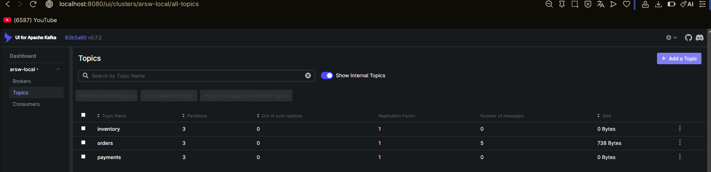

# ARSW-Taller3-Kafka

## Actividad 1 Analisis de comunicacion

1. Consultar productos: Sincrono, ya que el cliente debe ver el resultado de sus productos de manera inmediata para poder realizar la compra de los mismos.

2. Crear pedido: Hibrido, ya que el cliente debe esperar la confirmacion de su pedido, pero no es necesario que espere a que se procese el pedido para poder continuar con otras acciones.

3. Validar pago: hibrido, ya que el cliente debe esperar la confirmacion de su pago, pero no es necesario que espere a que se procese el pedido para poder continuar con otras acciones.

4. Enviar notificacion: asincrono, ya que el cliente no necesita esperar a que se envie la notificacion para poder continuar con otras acciones.

5. Actualizar analitica: asincrono, ya que el cliente no necesita esperar a que se actualice la analitica para poder continuar con otras acciones.

6. Registrar auditoria: asincrono, ya que el cliente no necesita esperar a que se registre la auditoria para poder continuar con otras acciones.

## Actividad 2 Decisiones de configuración

## Actividad 3 

